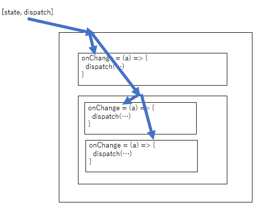
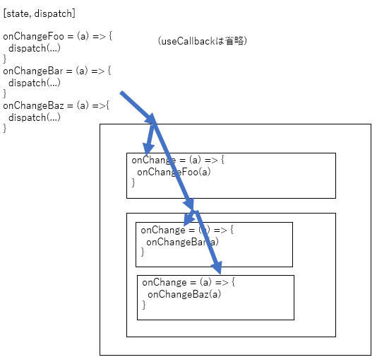

# React で useReducer の dispatch を props でどこまで流すのか。

## 前置き

React で少し階層が深いコンポーネントにおいて useReducer の dispatch をどの階層まで渡すべきか。どこでイベントハンドラを書くのか。その辺について検討する場面があったので、記録しておく。

## 結論

- 再利用しないコンポーネントまでは dispatch を流してもいい。
- あるいはそもそも dispatch+ロジックを書く層と表示層を完璧に分断する。

## 過程

まず useReducer についてこれを読んだ。

- [useReducer の本質：良いパフォーマンスのためのロジックとコンポーネント設計](https://qiita.com/uhyo/items/cea1bd157453a85feebf)

useReducer を用いて状態の更新関数を状態に非依存にすることによって、React.memo によるパフォーマンス改善に大きく役立つという話だった。React 触り始めの私はこれに飛びつき dispatch をそのまま流した。感覚的に完全な末端までは流さなかったが、ざっくり次の図のようになった。

翌週、子コンポーネントを別の用途で使いたくなった。しかし dispatch と密結合なので当然そのままでは再利用できず困った。次に私は dispatch とそれを使う関数を親コンポーネントで作成し、それを流すことにした。

これによって再利用できるようになった。ではどのコンポーネントまで再利用性を考慮するのか。要は dispatch をそのまま流すとパフォーマンスは確かに簡単にあげられるけど、再利用性が落ちることとトレードオフであるというだけの話ですが。

dispatch をどこまで流すのかについて検討しているところ、「Presentational and Container Components」という考え方があることがわかった。見た目の表示と状態管理を層で完全に分離するという考え方を 2015 年の時点で Dan Abramov 氏が提唱していた。

- [Presentational and Container Components](https://medium.com/@dan_abramov/smart-and-dumb-components-7ca2f9a7c7d0)

しかし上記ページの冒頭に 2019 年にこのような追記がなされている。(DeepL 翻訳)

> 2019 年からの更新：この記事を書いたのはかなり前のことで、私の見解はその後進化しています。特に、私はもうこのようにコンポーネントを分割することをお勧めしません。あなたのコードベースでそれが自然であることを見つけるならば、このパターンは便利です。しかし、私はこのパターンが必要もなく、ほぼ独断的な熱烈さで強要されているのを何度も見てきました。私がこのパターンを便利だと感じた主な理由は、複雑なステートフルロジックをコンポーネントの他の側面から切り離すことができたからです。フックは、任意の分割なしに同じことをさせてくれました。この文章は歴史的な理由からそのままにしていますが、あまり深刻に受け止めないでください。

少人数で開発しているうちは「再利用しないコンポーネントまでは dispatch を流してもいい。」程度で問題ないが、関わる人が多くなると厳密なルールがより重要になるので Presentational and Container Components のようにルール化して層分離すべきではないかというのがひとまずの結論。後者の方がソースの部分的な分量自体は多くなるというデメリットはあるが、規模が大きくなるほど再利用性とわかりやすさのメリットがそれを上回るだろう。

## 蛇足

最適化について調査しているときに次の記事が目にとまった。いわく、React は速いから、ほとんどの場合不要なレンダリングの最適化は気にすることはないと。

- [When to useMemo and useCallback](https://kentcdodds.com/blog/usememo-and-usecallback)
