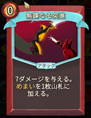
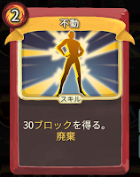
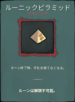

# slay the spire アイアンクラッド攻略メモ

最近アイアンクラッドのアセンションにチャレンジし、20 まで終えたので覚えていることを書く。

得点制のカード評価ではなく、実際にプレイする中で面白かった組み合わせや感じたことを書く。良いカードが引けるまでリセットするのではなく、勝率を上げるためにどうするかを考えてプレイしている。

言及していないカードに関しては使っていないかよくわかってない。

## 最重要ポイント - エナジーの確保

まず何より重要なのはエナジー供給カードを入手することだ。

アイアンクラッドはカードパワーが高い一方でエナジー不足に陥りやすい。エナジー供給カードがアンコモン以上にしかないためである。もしエナジー供給系カードを取らずに Act1 ボスでもまともなエナジー系レリックを入手できなかった場合、Act2 でエリートを轢き殺すのが非常に難しくなる。
また Act1 でエナジー系カードを取ると、ルーニックピラミッドやルーニックキューブの効果を最大限に引き出すことができる。ボスレリックの受け入れ幅を広げるのは勝率を高める。

供物が弱いデッキってあるんですか？。初手のセットアップにはもちろんのこと初手でバーストダメージを出すためにも使える。単体で完結しており UG しなくても強い。2 枚入れると初手が格段に安定する。ただし 2 枚目は思考停止で使うと回復が足りなくなりがちなので注意すること。あくまで初手に来る確率を高めるための 2 枚取得。

激昂はノーデメリットだが UG しないと 1 コストである点が使いにくい。コストを使い切りながらドローした際に腐ってしまう。例えばポンメルストライクや受け流しで激昂を引いても UG 前だと使えない。一方で UG さえすれば 0 コス 2 エナとなり使いやすい。使い捨てなのでセットアップ利用のみとなる。UG の目途があり、エナジー系１枚目なら取得して良いだろう。もしまともなドローをまだ持っていなければポンメルストライクを UG してごまかす。

瀉血は体力消費こそあるものの、UG 無しで 0 コス 2 エナ生成なのが非常に強い。UG 無しでも十分なのが本当に偉い（二度目）。もし Act1 で見つけたら即取得するし店で見つけても即購入する。HP 消費が 3 であることは、その後のパワーやボスレリックの受けの広さを考慮すれば全く問題にならない。Act2 以降では検討の余地がある。もし Act1 でエナジーレリックと供物を拾えているなら、高回転デッキでない限りは不要かもしれない。とはいえ相当ドローが死んでない限り私は取る。

狂戦士は正直よくわからなかった。上記のエナジー系はセットアップに使えるカードだが、狂戦士はセットアップが必要なカードである。レア枠を食ってなければありだったかもしれない。

以後いくつか印象に残っているカードを示すが、すべてはエナジーが足りていることが前提である。アイアンクラッドはとにかく重い。

## 状態異常を絡めたデッキについて

### デッキに状態異常を追加する

やせ我慢は状態異常デッキのキーカードだ。パワー発動時に生じるブロックの甘さをケアしながら、デッキ 2 週目のコンボ準備を 1 コストでこなすことができる。もしデッキの方向性が決まってない時に見つけたら先行取得して、下記の各種コンボを探しに行くプレイが好きだ。いいから店で進化を買え。
他にもアイアンクラッドはデッキに状態異常を加えるアタックカードが 3 枚ある。それらは状態異常デッキで使えばデメリットを無視できる高火力カードという位置づけであり、拾ったから状態異常デッキへの道が確定するというようなものではない。したがって後ほどダメージ枠として個別に紹介する。

### デッキに追加された状態異常を対策する

基本的にドローだけがデッキに追加された状態異常への対策となる。デッキに状態異常が入ってもそれより多くドローすれば問題にならない。デッキ 3 週目以降においては、状態異常を廃棄できていれば 2 週目と同速となる。そして廃棄するには、廃棄カードと状態異常を同時に引かなければならない。もし手札の枚数が少ないと同時に引ける確率は下がる。したがって
状態異常対策としては何にせよより多くドローする必要がある。

#### 進化

進化は状態異常に対するドローカードとして最も優秀である。安定性もパワーもほとんど替えが効かない。何としてでも手に入れたい。進化を 1 枚入れれば状態異常対策という意味でのドローカードはもはや不要となる。UG すると 2 枚ドローになるので状態異常がメリットになる。手札上限には注意しよう。ところで進化は状態異常追加系カードがデッキに無くても、状態異常を追加してくる厄介な敵の対策になる。Act1 ではセントリー、スライムボス、ヘクサゴースト、Act2 では選ばれし者など。デッキの方向性が決まる前に進化から先に拾って、状態異常デッキの足掛かりにするとよい。進化を拾ったあとにやせ我慢を店で見かけたら買おう。

#### 闇の抱擁 & セカンドウィンド

闇の抱擁だけではドローできないので、単体では状態異常対策にならない。また 1 枚廃棄系と合わせるだけでは闇の抱擁を撃つロスを回収しにくい。また UG しないと 2 コスなので撃てるわけがない。闇の抱擁を 2 コスで使って問題ないデッキは、たいてい闇の抱擁が無くてもほとんど完成している。つまりは進化がどうしても拾えないときに限り、闇の抱擁+ & セカンドウィンドで場をつなぐことになる。もちろん一番セカンドウィンドを強く使えるのも進化だが、闇の抱擁では大量廃棄系が必須なのであえて書いた。

#### 闇の抱擁 & 霊魂切断 & 無痛

セカンドウィンドの代わりに霊魂切断を入れると、コスト消費が激しい上にブロックが無いので無痛が欲しい。また必要パワーが増えるのでセットアップを加速させるために供物が欲しい。もちろんこれだけではブロックが足りなくなるので、早々に進化あるいはセカンドウィンドをデッキに入れたい。どちらか片方が手に入れば一気に強力なデッキになる。

闇の抱擁は進化と違い、取得タイミングに関して注意すべき点がある。まず闇の抱擁をセカンドウィンドや霊魂切断より先に取得すると実質呪いと化す。また両方取得出来ても、Act1 ではエナジーが足りない。したがってデッキの方向性が定まらないうちは闇の抱擁をすべきではない。

セカンドウィンドと霊魂切断が混ざるデッキはヘッドバットを入れると事故率が激減する。ただし闇の抱擁があると廃棄でドローしてしまうので、ヘッドバットを撃つタイミングには注意が必要。

### 状態異常デッキでダメージを出す

状態異常デッキはやせ我慢、セカンドウィンド、無痛のようにブロックを得る強力な組み合わせがある一方で、ダメージを出すのが少し難しい。

#### デッキに状態異常を追加するアタックカード

ワイルドストライクはコモンで入手しやすく、単体高火力で Act1 のエリートに対し強い。ゆえに再序盤の 1 枚目は何も考えず拾って即 UG。もしデッキの方向性が定まっており火力が足りているなら取らなくていい。

焼身は範囲高火力で Act2 終わりぐらいまで非常に強い、というか常に強い。問題はレア枠だから他のキーカードと入手機会を食い合うこと。

無謀なる突進は再序盤においては 0 コストダメージが弱いわけないので取る。それ以降は正直よくわからなかった。ドローが有り余ってるとか進化が瓶に詰まってるなら取ればいいような気もするが、結論は出ていない。

どれもスケールしないので、Act2 ぐらいまでは強力だが Act3 で少し辛くなる。

#### 炎の吐息 & 進化

進化に炎の吐息を組み合わせるとダメージソースになる。炎の吐息デッキの霊魂切断はどちらかというとノイズになりがちだった。追加で欲しいのはブロックでありダメージではない。恐らくは炎の吐息をダメージソースとして安定して使うには進化が必要という方が正確か。もし進化無しで炎の吐息が十分ダメージを出しているなら、手札は状態異常だらけでブロックが不足するだろう。後述する闇の抱擁&セカンドウィンドでも一応使えないことはないが、その場合供物 2 枚とバリケード+ぐらいまで入れないとセットアップを終えられない、相手が死ぬまで耐えきれない、ドローが足りずに事故死するなどの問題が起きやすい。

#### ボディスラム+

ブロックを得やすい状態異常デッキにおいて、それがそのまま火力になる攻防一体のカード。UG で 0 コストにすれば 1 コスト多くブロックに割くことができ、それがそのまま攻撃力になるのでボディスラムは UG 効果が高い。コモンで入手も容易なので、1 枚は入れておこう。

#### バリケード & 塹壕

ダメージを出すというよりは、ダメージを出す必要を無くすという意味。敵の攻撃上昇より早くブロックを貯めることによって完全に受けきる。引き継いだブロックに塹壕を重ねて要塞になろう。バリケードも塹壕もコスト減のため UG 優先度が高い。

道中の雑魚戦ではバリケードを撃つより先に敵を倒したいこともあるので、ボディスラムを 1 枚入れておくとよい。ところでバリケードとボディスラムを組み合わせると高いダメージが出るのは間違いないが、本質的には別物として捉えるべきだ。バリケードによって余剰ブロックを十分に用意できたならボディスラムが無くても既に勝っている。例外は後半に異常なスケールを見せる心臓ぐらいだろう。いずれにせよボディスラムはデッキに入るが、プレイングとしては別という意味だ。

関連レリックとしてカリパスを添えておく。塹壕まで使って倍倍ゲームをするならカリパスでも何とかなった。バリケードと違い発動隙が無いため、ヘッドバットなどで塹壕使いまわしの用意があるのなら便利な場面もあるのではないかと考えている。

#### カロンの遺灰 & 進化 & セカンドウィンド

進化+メイン火力が用意できるまでの優秀なサブ火力となる。

## 筋力を高めるデッキについて

筋力を高めるデッキは悪魔化と弱点発見の 2 種類がある。攻撃手段は同じだが、筋力を高める部分の構築が異なる。

### 悪魔化デッキ

悪魔化は使えさえすれば文字通り圧倒的なパワーのため、使う際の隙をどう消すのか、筋力が上がるまでどう耐えるのかが問題になってくる。極論、悪魔化デッキに発火と弱点発見は必要ない。悪魔化さえ発動できればベースの筋力アップはこれ 1 枚で十分だからだ。リミットブレイクで倍率を当てられればさらに良いが、Act3 をクリアするだけなら必須ではない。心臓を倒すつもりなら必須…かと思われたが、履歴を見たら A10 のときリミブレ無し悪魔化で心臓を撃破していた。slay the spire とかいうゲーム、本当に何もわからない。

悪魔化を Act1 序盤で拾えたら組み始めればよいが、大抵は Act1 ボスでの入手になる。もしその時点でバリケードや堕落のような 2 コスト以上のパワーや進化&やせ我慢のような方向性が確定する組み合わせを持っているなら、それらとシナジーがあるレアカードを優先して取る。リミットブレイクは他に筋力カードがなければ呪いなので、先に取ることはない。

他のデッキに行くキーカードを拾えないまま目先を解決するだけのグチャグチャなデッキになってしまったとき、Act2 ぐらいで拾って UG すると低アセンションではごまかせたりする。

#### 供物

供物が弱いデッキは無いが（二度目）、悪魔化デッキでは特に欲しい。初動の発動確率を高め、防御カードに 2~3 コスト分割くことができる。悪魔化を引いた後に店で見つけたら必ず購入する。

#### 荒廃 & デッキトップ操作

悪魔化を踏み倒すプラン。

雄叫びは、2 ドローになり発動時手札が減らなくなるので UG を強く推奨。仮に荒廃コンボが決まらなくても初手で悪魔化を使える可能性が高まるので悪くはない。

荒廃はデッキ圧縮とコスト踏み倒しが同時にできる強力なカードだが、使いたくないあるいは廃棄したくないカードが山にある時は使えない。目的がはっきりするまでは取得優先度は落ちる。エナジー系のカードレリックを全く拾えなかったときは荒廃+を祈りながら撃ちまくってごまかすという使い方もできる。

#### 狂気、啓発 & ドロー

悪魔化のコストを下げて踏み倒すプラン。同時に引かなければいけないので、何らかのドローを用意しておくこと。

#### 死神

悪魔化ターンはボディで受けて、ムキムキになってから取り返す。敵の残り HP を超えての回復はできない、アーマーを削った分は回復しないなどの制約があるので注意すること。

#### 幻姿

発動ターンから筋力が上がるまでの全ダメージをカットできる。悪魔化+幻姿複数枚を引いてしまった時のために、エナジーを多めに確保したり雄叫び+で山に返したりしたい。

#### 優秀な防御手段各種

各種優秀な防御系カードを入れる。0 コストの脱力は悪魔化を使うターンにも撃ちやすいので貴重。目くらましの店購入を検討すべきだと思う。

### 弱点発見デッキ

弱点発見でベース筋力を上げるデッキは、どれだけ素早く弱点発見とリミブレを回せるかの勝負になる。悪魔化デッキに比べると構築とプレイングが難しい。しかしデッキが完成した後は弱点発見デッキの方が筋力上昇は早い。また相手に合わせて速度を調整しやすい。相手の行動に依存するという問題には発火を 1 枚刺して緩和しよう。

基本的にデッキは薄く保ち、アタックカードは増やし過ぎないこと。ドローとエナジーを潤沢にして、1 ターンに弱点発見やリミットブレイクを 2 回以上使えるデッキを目指す。

このデッキはリミットブレイクが必須なので、弱点発見を 1 枚拾っただけで弱点発見デッキに方向を確定させることはしない。弱点発見を拾えたら少し圧縮回転重視に構築を向け、供物、受け流し、雄叫びなどデッキの方向性が変わっても強いカードを優先して拾いつつリミットブレイクを探す。最も多いのは Act1 の道中で弱点発見を拾い、Act1 ボスでリミットブレイクを拾うケースだろう。もし先に堕落、バリケード、進化など他のキーカードを見かけたらリミットブレイクはひとまず諦めてそちらに寄せ始める。

#### ヘッドバット

デッキ枚数に関わらず弱点発見やリミットブレイクを使いまわせる。攻撃カードのため同時に細かい敵を処分できる点も強い。弱点発見デッキにおいてはどう使っても雑に強いので、単体でピックアップ。後述の各種コンボとも組み合わせよう。

弱点発見デッキでなくとも幅広く役に立つカードなので、Act1 序盤で拾ってしまっていることも多い。

#### デッキトップ操作

弱点発見は敵が攻撃を予期してないと使えないので、手札から山札の上に戻す各種カードでタイミングをコントロールすると安定する。予測はレアなので入手しにくいが、UG すると何回でも使えるので非常に安定する。

#### 瀉血 & ドロー(キャントリップを含む)

供物が弱いデッキは無い（三度目）。ところで体力が多い敵ボス級にはデッキを 2 週目以降も回す必要があるから瀉血が強い。店買いしてでも手に入れる。後はドロー効果を持つカードを重視する。例えば 1 コストドローとヘッドバットを組み合わせると 4 エナで 2 回リミットブレイクを撃てる。そこで瀉血を撃って攻撃エナジーを確保すると 1 ターン早く敵を倒せるので被弾が減る。

キャントリップ系は手札の総数が増えるわけではなく、手札を減らさず使えるだけだ。1 コスト以上のキャントリップ系を取るときはそのカードの効果が欲しくて潤沢なエナジーがあるかどうかを考えよう。例えば筋力上げの最中にブロックは欲しいから受け流しは 2 枚あっても強いだろう。しかしポンメルストライクは事実上エナジーを 1 消費しただけになるかもしれない。もしポンメルストライク+なら手札が 1 枚増えるので、瀉血をすでに持っていてドローカードが足りていないなら検討の余地がある。こういったことを考慮しながら各種ドロー効果を持つカードを入れていく。

#### 筋力デッキにおける攻撃手段

筋力は攻撃 1 回ごとにかかるので、基本的には多段攻撃を取る。余計なアタックカードを取って、悪魔化の初手率を下げたり弱点発見リミットブレイクの回転率を下げたりするのは NG。

ツインストライクは筋力 2 倍と控えめだが、元の火力が UG で 14 点と高いのでデッキの方向性が決まる前に取っていることが多い。もしヘヴィブレードを持っていて、デッキの圧縮が進んでいるなら後半でわざわざ取る必要はない。

ヘヴィブレードは 2 コストと少々重いが UG すれば 1 枚だけで筋力 5 倍が出せるので、デッキ内のアタック率を下げられるのが偉い。悪魔化、弱点発見どちらにせよ、筋力を上げている最中のアタックは呪いに近いので、余計なアタックカードは混ぜたくない。例えばツインストライク 2 枚の方が小回りは効くが、ヘヴィブレード 1 枚の方が筋力を上げる効率が良い。

旋風刃はもともと強いが、筋力デッキにおいてはさらに強い。筋力 X 倍なのでアタックカードが少なく済む。また範囲攻撃なので筋力さえ確保すればすべてを破壊できる。圧倒的に強い。強いて言うならコンボでリミットブレイクを使った後にはエナジー確保のため 1 ターン待たなければならないことが弱点かもしれない。旋風刃が見つからないときはなぎ払いでごまかそう。なぎ払いでも筋力が上がれば取り巻きぐらいなら殲滅できる。

猛撃は 1 コストの筋力 4 倍(UG5 倍)であり、使えば廃棄できるのでデッキを回す邪魔にもなりにくい。筋力系デッキは十分に筋力を上げてからカード 1 回で仕留めることも多いので、猛撃の廃棄効果はそこまで問題にならない。筋力デッキにおいて 1 枚目なら取る。いくら廃棄できるとはいえデッキ一巡目が重くなりすぎるように感じたので、猛撃 2 枚目は取らない。

フォーカスして敵の頭数を減らすのが重要なこのゲームにおいて、ブーメランとかいうランダム打点はクソ過ぎるので私は絶対に採用しない。嫌いすぎて画像を貼る気も起きない。

## 再序盤のプレイング

Act2 以降は Act1 でおおむね決まった方針でプレイを進めていくだけという程度の解像度でしか認識できていない。いまわかっている Act1 のプレイングについてのみ書く。

### エリートを倒すために打点を強化する

Act1 ではエリートを倒してデッキの中核足りうるレアカードやレリックを入手することが肝要だ。そして Act1 のエリートは例外なく長期戦性能が高いので少しでも長引くとこちらが死ぬ。勝つためにストライクよりバリューがあるアタックカードを入れて速攻をしかけよう。 3 枚ぐらい入れて 1 枚 UG して、ポーションを 1 個切るとおおむね 1 体目のボスに対して火力が足りる。

### キーカードを引くまではデッキタイプに寄らず使いやすいカードを入れる

コンボで強いが単体では弱いカードは先行して取得すべきではない。例えば闇の抱擁は必ず廃棄カードより後に取得しなければならない。単体でもそこそこ使えるカードが引けるまでは、どのデッキに入れても一定以上の活躍が見込めるカードから取得していく。遅くとも Act1 のボス報酬をもらったあたりで方向性を決めたいところではある。

これまでも説明したように、受け流し、バトルトランス、ヘッドバット、ポンメルストライク、供物あたりはどのデッキに入れても邪魔になりにくい。

瀉血は単体だと邪魔になりうるが、一番最初に書いた通り受け入れ可能な選択肢を増やせるので序盤から意識して拾う。

衝撃波は攻防一体、使ったら消えてくれる便利カードだ。強化すると脱力 5 弱体 5 にり、もはや強打すら不要になる。

旋風刃はどのデッキタイプでも Act2 までは群れ破壊カードとして強い。例えば 4 エネあれば A20 のビヤードの群れを一発で無力化できる。一方で Act3 では筋力がないと主火力としては少し厳しいことに注意しよう。

## その他、曖昧な良いコメント

### カード

#### 発掘

状況に応じて 2 回使う廃棄系カードを選べるのがとても強い。例えば雑魚は鬼火を 2 回使って瞬殺、ボスは供物 2 回目を撃ってスケール優先といったように。とはいえ強い廃棄カードはレアに固まっているから、同時に拾えたならかなり運が良い。

### レリック

#### スネッコアイ & 高コストカード

高コストカードが多いので、スネッコアイを活用できる。コンボが完成しているなら取る必要はない。

#### ルーニックピラミッド or ルーニックキューブ

エナジーさえ確保できれば、ルーニックピラミッドとルーニックキューブが強い。Act1 で瀉血推しする理由はおもにこれらドローレリックを強く使うため。
例えば鬼火+で 9 枚焼けば 90 点ダメージになる。手札を増やせばダブルタップと強いアタックを同時に引きやすい。

#### コーヒードリッパー & 回復系

アイアンクラッドは初期レリックや死神による回復があるので、コーヒードリッパーが比較的取りやすい。戦闘中のデメリットが存在しないことに注目し、店買いのポーションもしっかり活用しながらデッキを強化して、ダメージを受けないように立ち回ろう。

#### 古木の枝 & 堕落

堕落により 0 コストになったスキルを使って廃棄されたとき枝の効果で手札に加わったスキルを 0 コストで使うゲームになる。

#### 苦痛の印 & 進化

苦痛の印によるデメリットを進化で抑える構築。とはいえ進化を使う前のドローを負傷に阻害される可能性があるので、さらにドローソースを持っておきたいところ。

#### ネクロノミコン

アイアンクラッドは強力な 2 コスト以上のカードが多いので、ネクロノミコンで複数回使用が強い。

## その他、曖昧な悪いコメント

なんかよくわからないものによくわからないとコメントする会。

### ベルベットチョーカー

slay the spire を始めた直後ぐらいは、アイアンクラッドは高コストカードが多いからチョーカーもいけるかと思っていた。しかしそれは間違いだった。結局まともにデッキパワーを上げると 6 回で済まないターンが出てくる。act1 終了の時点では問題なさそうでも、act3 までに堕落と枝を引くかもしれない。というか引いた。クソが。堕落と枝ほど露骨でなくても、普通にデッキ組んで普通に回してたらセットアップで 6 枚以上使う。あと Act3 の転がってる頭に粉砕されがち。ベルベットチョーカーが問題ないと感じるならそのデッキは弱いのでは。とにかくデッキの可能性を狭めるレリック。act1 でこれ取るぐらいなら小さな家を取ると心に決めた。

### ランページ

使えるんじゃないかと思って 3 回ぐらいチャレンジしたけどいまいち。ランページでやるべきはデッキを圧縮しヘットバッドで同じカードを使いまわすことだが、それならリミットブレイクを連打する方が早い。特化デッキではなく何かのサブ火力だろうか？

### 強打

強いのか弱いのか…。何回か代替の弱体カード無しで削除してみたら、打点不足で困った。Act1 のボスまでには弱体化手段を用意しないといけないらしい。しかし Act1 のエリートのうち強打を強化して嬉しいのはボスグレムリンだけ。ということで、Act1 のエリート戦がすべて終わるまでに衝撃波、つまずき、アッパーカットが手に入ったら削除、そうでなければ強化だろうか？そのまま放置して弱体サブとして便利なこともあるし、よくわからない。

### フレックス

始めてしばらくは好んで取っていたが、ドローが無い 0 コストが後半邪魔になってることに気づいて悩み始めた。ルーニックピラミッドを拾った後なら強く使えるけど。筋力デッキだからといって弱点発見デッキなどに入れると本命のリミブレ連打の邪魔になりがちなのは間違いない。よくわからない。
