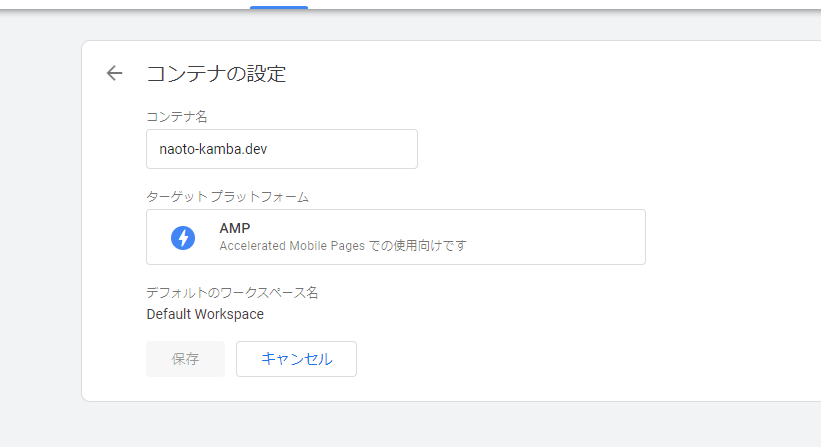
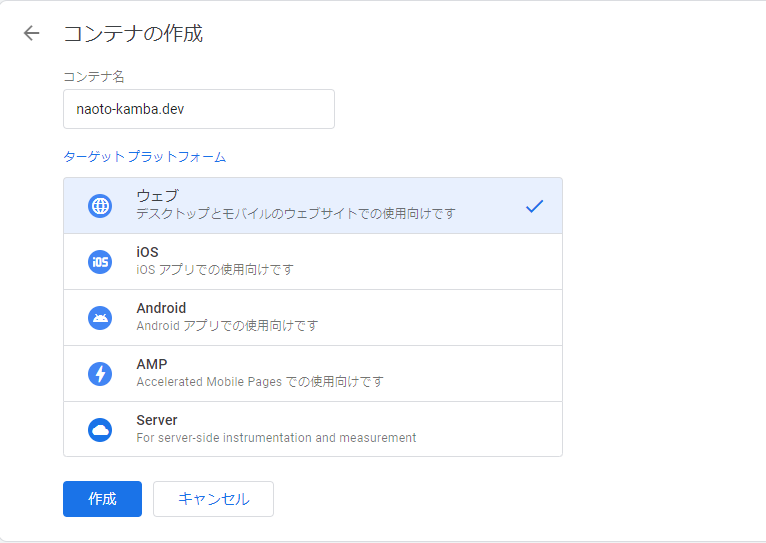
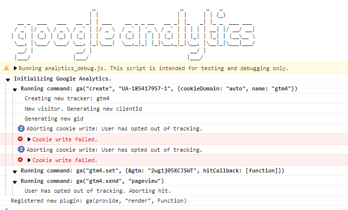
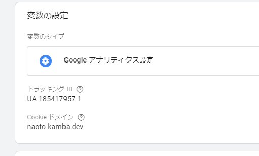
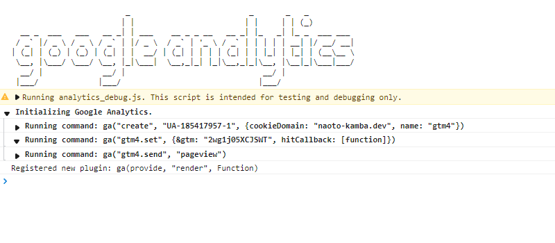

# 当ブログから AMP を廃止する話

## 前置き

AMP のデメリットが改善されないまま Google の AMP 優遇が終わったので、AMP は下火になると思われる。AMP を廃止する。

## Next.js の AmpConfig

各ページの最初に Next.js の amp 有効 config を書いていたので、それを削除

## AmpImg を廃止

unified の独自 Plugin で Img を AmpImg に自動変換していた箇所を削除

## GoogleAnalytics 対応

過去のコンテナ名を画像の状態から naoto-kamba.dev-amp に変更



新規コンテナをウェブ向けに作成



[前の記事](/posts/202104072209_install_google_analytics)を参考に、今回作成したコンテナにも Google Analytics を追加する。

[https://github.com/vercel/next.js/tree/main/examples/with-google-tag-manager]を参考に追記していく。

\_document.tsx の HEAD に script を挿入

```typescript
import Document, {
  Html,
  Head,
  Main,
  NextScript,
  DocumentContext,
} from 'next/document'

class MyDocument extends Document {
  static async getInitialProps(ctx: DocumentContext) {
    const initialProps = await Document.getInitialProps(ctx)
    return { ...initialProps }
  }

  render() {
    return (
      <Html lang="ja">
        <Head>
          <script
            dangerouslySetInnerHTML={{
              __html: `
(function(w,d,s,l,i){w[l]=w[l]||[];w[l].push({'gtm.start':
new Date().getTime(),event:'gtm.js'});var f=d.getElementsByTagName(s)[0],
j=d.createElement(s),dl=l!='dataLayer'?'&l='+l:'';j.async=true;j.src=
'https://www.googletagmanager.com/gtm.js?id='+i+dl;f.parentNode.insertBefore(j,f);
})(window,document,'script','dataLayer','GTM-5XCJSWT');
    `,
            }}
          />
        </Head>
        <body>
          <noscript>
            <iframe
              src={`https://www.googletagmanager.com/ns.html?id=GTM-5XCJSWT`}
              height="0"
              width="0"
              style={{ display: 'none', visibility: 'hidden' }}
            />
          </noscript>
          <Main />
          <NextScript />
        </body>
      </Html>
    )
  }
}

export default MyDocument
```

GoogleTagManager コンポーネントを作成

```typescript
import React, { useEffect } from 'react'
import { useRouter } from 'next/router'

const pageview = (url: string) => {
  window.dataLayer.push({
    event: 'pageview',
    page: url,
  })
}

const GoogleTagManager = ({ children }: { children: React.ReactNode }) => {
  const router = useRouter()

  useEffect(() => {
    router.events.on('routeChangeComplete', pageview)
    return () => {
      router.events.off('routeChangeComplete', pageview)
    }
  }, [router.events])

  return <>{children}</>
}

export default GoogleTagManager
```

\_app.ts に GoogleTagManager を追加

```typescript
import GoogleTagManager from 'components/GoogleTagManager'
import { AppProps } from 'next/dist/next-server/lib/router/router'

function MyApp({ Component, pageProps }: AppProps) {
  return (
    <GoogleTagManager>
      <Component {...pageProps} />
    </GoogleTagManager>
  )
}

export default MyApp
```

デプロイして Google Analytics Debugger で確認すると cookie write failed error



GoogleTagManager の CookieDomain を手動で設定したら成功した。





## SocialShare 系リンクの修正

amp-social-share で定義してた各種共有リンクを react-share で置き換え

before

```typescript
type SocialSharesProps = {
  url: string
}
export const SocialShares: React.FC<SocialSharesProps> = (props) => {
  return (
    <div className="social-shares">
      <amp-social-share type="line" aria-label="Share on Line" />
      <amp-social-share
        type="facebook"
        aria-label="Share on Facebook"
        data-param-app_id="145634995501895"
      />
      <amp-social-share type="twitter" aria-label="Share on Twitter" />
      <amp-social-share
        type="hatena_bookmark"
        aria-label="Share on Hatena"
        layout="container"
        data-share-endpoint={`http://b.hatena.ne.jp/entry/${props.url}`}
      >
        B!
      </amp-social-share>
      <amp-social-share
        type="pocket"
        aria-label="Share on Pocket"
        layout="container"
        data-share-endpoint="http://getpocket.com/edit?url=SOURCE_URL"
      ></amp-social-share>
      <style jsx>
        {`
          .social-shares {
            display: flex;
          }
          amp-social-share {
            margin-right: 5px;
          }
          amp-social-share[type='hatena_bookmark'] {
            width: 60px;
            height: 44px;
            font-family: Verdana;
            background-color: #00a4de;
            font-weight: 700;
            color: #fff;
            line-height: 44px;
            text-align: center;
            font-size: 28px;
          }
          amp-social-share[type='pocket'] {
            width: 60px;
            height: 44px;
            background-color: #ef3e55;
            background-image: url('/images/pocket-logo.svg');
            /* MIT License | https://icon.now.sh/ */
          }
        `}
      </style>
    </div>
  )
}
```

after

```typescript
import React from 'react'
import {
  FacebookIcon,
  FacebookShareButton,
  HatenaIcon,
  HatenaShareButton,
  LineIcon,
  LineShareButton,
  PocketIcon,
  PocketShareButton,
  TwitterIcon,
  TwitterShareButton,
} from 'react-share'
type SocialSharesProps = {
  url: string
}
export const SocialShares: React.FC<SocialSharesProps> = (props) => {
  return (
    <div>
      <LineShareButton url={props.url} className="share">
        <LineIcon />
      </LineShareButton>
      <FacebookShareButton url={props.url} className="share">
        <FacebookIcon />
      </FacebookShareButton>
      <TwitterShareButton url={props.url} className="share">
        <TwitterIcon />
      </TwitterShareButton>
      <HatenaShareButton url={props.url} className="share">
        <HatenaIcon />
      </HatenaShareButton>
      <PocketShareButton url={props.url} className="share">
        <PocketIcon />
      </PocketShareButton>
      <style jsx>{`
        div {
          display: flex;
          justify-content: left;
          gap: 10px;
        }
      `}</style>
    </div>
  )
}
```

これにて移行完了。じゃあな AMP
